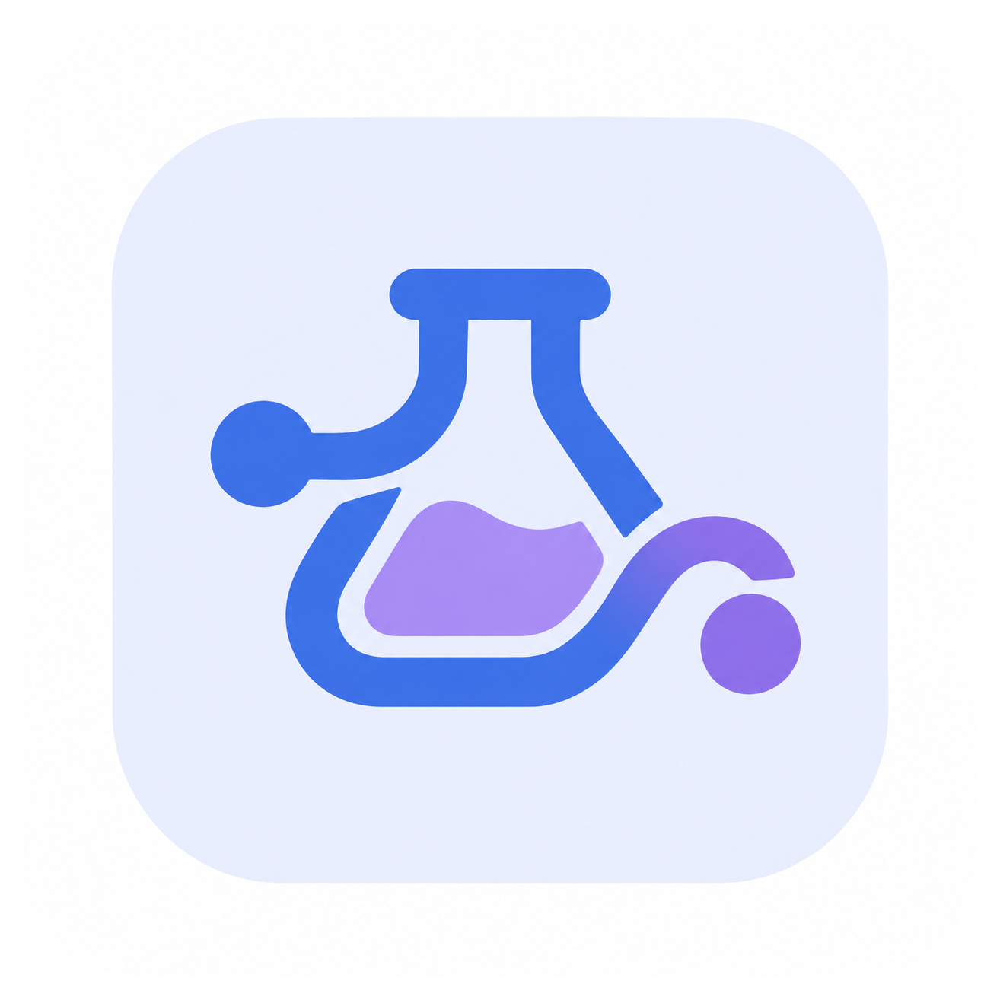

  

<h1 align="center">Dokumentasi chemflow</h1>

  
  
  
  
  
  
  

Untuk instalasi, cara pakai, dan panduan langkah-demi-langkah (termasuk
untuk pengguna yang belum pernah memakai terminal), lihat
[`README.md`](../README.md) di root repo. Halaman di folder ini adalah
referensi teknis lanjutan: diagram alur algoritma tiap tahap pipeline,
ditulis sebagai Mermaid flowchart (render otomatis di GitHub, GitLab, dan
kebanyakan editor Markdown).

- [Alur Utama Pipeline (termasuk Resume dan checkpoint)](pipeline-overview.md)
- [Preparasi Ligan](ligand-preparation.md)
- [Preparasi Reseptor](receptor-preparation.md)
- [Konfigurasi Reseptor Interaktif](receptor-config.md)
- [Docking (Resolusi Vina & Matriks)](docking.md)
- [Validasi RMSD Redocking dan Ligan Native](rmsd-validation.md)
- [Merge Kompleks & Analitik (PCA gaya jurnal, HCA, Heatmap, Grafik per Grup, Pemotongan Grafik)](merge-and-analytics.md)
- [Ekspor Interaksi Otomatis dari BIOVIA (termasuk penguncian input)](biovia-interactions.md)
- [Analisis Similaritas Interaksi](similarity-analysis.md)
- [Analisis GC-MS (opsional)](gcms-analysis.md)
- [Pemakaian sebagai Library](library-usage.md)

## Tentang

chemflow merangkai seluruh alur skrining virtual (preparasi, ADMET, docking
AutoDock Vina, validasi RMSD, analitik) dalam satu perintah, dengan analisis GC-MS opsional. Dikembangkan oleh
Arif Maulana Azis dan dirilis dengan lisensi MIT. Ringkasan proyek, versi,
dan tautan repositori ada di bagian [Tentang](../README.md#tentang) pada
`README.md`.
