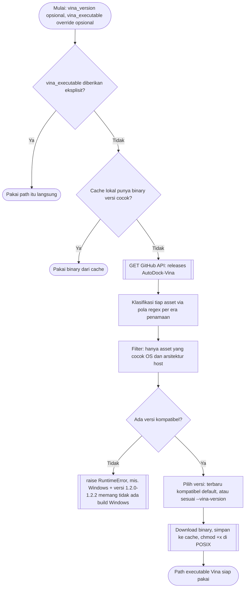
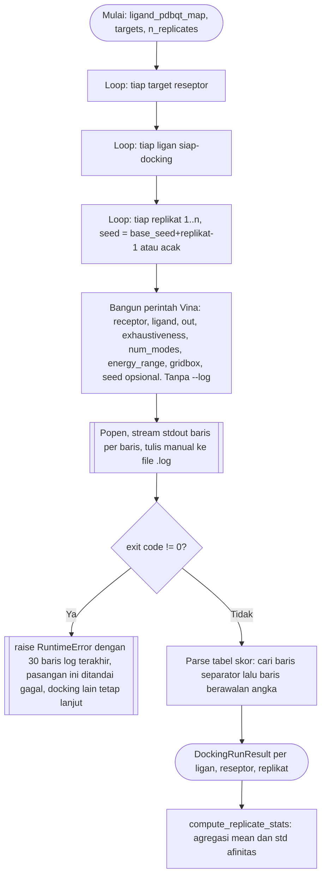

# Docking: Resolusi Vina dan Matriks Docking

Implementasi: `chemflow.docking.vina_manager.VinaReleaseManager`,
`chemflow.docking.vina_runner.VinaRunner`, `chemflow.docking.docking_matrix.DockingOrchestrator`.

## Resolusi executable AutoDock Vina

Resolusi tidak pernah bergantung pada PATH sistem. Baik override manual
maupun hasil auto-download selalu berupa path absolut yang langsung
dieksekusi.

Era penamaan asset: legacy 1.1.2 (`autodock_vina_1_1_2_*`), transisi
1.2.0 sampai 1.2.3 (`vina_X_linux_x86_64`, dan Windows baru muncul di
1.2.3), current 1.2.4 dan seterusnya (`vina_X_win.exe`,
`vina_X_linux_aarch64`, dan seterusnya). Versi 1.2.0 sampai 1.2.2 tidak
menyediakan build Windows sama sekali.

## Matriks Docking

Mendukung multi-PDB (setiap baris reseptor unik di-dock terhadap semua
ligan) dan multi-situs (kode PDB yang sama dengan gridbox berbeda pada
baris berbeda menghasilkan kunci target yang berbeda pula).

## Sumber gridbox

Gridbox dibaca dari kolom `center_x/y/z` dan `size_x/y/z` Excel reseptor.
Jika kosong, pipeline meminta pengguna memilih ligan native saat run
berjalan. Pengguna yang belum tahu koordinatnya dapat menyusun Excel itu
lebih dulu dengan `chemflow receptor-config`
(lihat [Konfigurasi Reseptor Interaktif](receptor-config.md)).
