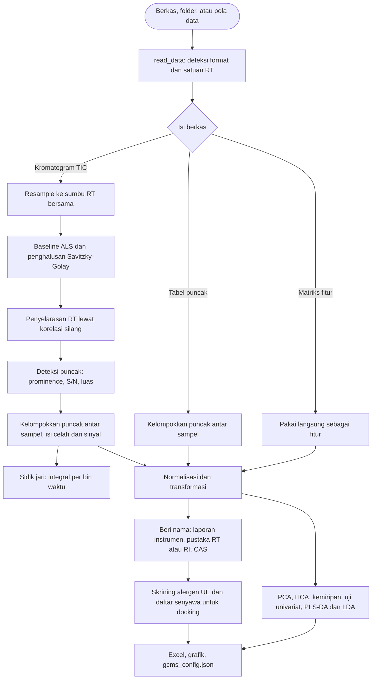

# Analisis GC-MS

Fitur opsional untuk membandingkan data GC-MS (misalnya parfum asli terhadap tiruan, atau
beberapa produk) dengan kemometrik. Analisis ini berdiri sendiri: tidak butuh docking, tidak
mengubah hasil pipeline utama, dan bisa dijalankan ulang kapan saja pada folder keluaran yang
sama. Gaya PCA mengikuti Aghoutane et al. (2023), *Micromachines* 14(3):524,
DOI [10.3390/mi14030524](https://doi.org/10.3390/mi14030524). Bedanya, chemflow tidak berhenti
di plot: ada pemrosesan sinyal, penyelarasan waktu retensi, uji statistik dengan koreksi FDR,
model terawasi yang divalidasi silang, dan skrining alergen.

## Cara menjalankan

Mandiri, tanpa docking:

```
python -m chemflow gcms --data data-gcms/ --output hasil/
```

Sebagai tahap tambahan pada `chemflow run` (berjalan setelah analitik, kegagalannya hanya
menjadi peringatan dan tidak memengaruhi docking):

```
python -m chemflow run --ligands ligan.xlsx --receptors reseptor.xlsx --output hasil/ --gcms data-gcms/
```

Hasil selalu ditulis di `hasil/gcms/`. Menjalankan `chemflow gcms --output hasil/` tanpa
`--data` memakai ulang data dan pengaturan analisis terakhir (dari `gcms/gcms_config.json`
atau dari `chemflow run --gcms`); opsi yang Anda tulis menimpa pengaturan tersimpan. Bila
tidak ada riwayat, perintah berhenti dengan pesan yang jelas. Tanpa argumen GC-MS, pipeline
tidak menyentuh kode ini sama sekali.

## Diagram alur



## Format data yang dibaca

Format dikenali dari isinya, bukan hanya ekstensi. Satu folder boleh berisi campuran format.

| Format | Isi yang dikenali |
|---|---|
| `.xls`, `.xlsx`, `.xlsm` | Ekspor GCMSsolution (Shimadzu) bersekat `[Header]`, `[MS Chromatogram]`, `[MS Peak Table]`; tabel kromatogram; tabel puncak; matriks fitur. Setiap sheet dibaca terpisah. |
| `.csv`, `.tsv`, `.txt`, `.dat` | Sama seperti Excel. Pemisah (tab, titik koma, tegak, koma, atau spasi) dan penyandian (UTF-8, UTF-16, Windows-1252) dideteksi otomatis, termasuk koma desimal. |
| `.cdf`, `.nc` | ANDI-MS netCDF klasik (waktu dalam detik, `total_intensity`). Berkas netCDF4/HDF5 ditolak dengan saran mengekspor ulang. |
| `.mzML`, `.mzXML` | TIC dari kromatogram `TIC` atau dijumlahkan dari spektrum MS1 (larik biner zlib atau tanpa kompresi). |

Bentuk isi tabel yang dikenali:

- **Kromatogram**: kolom waktu (`Ret.Time`, `R.Time`, `RT`, `Time`, `Waktu Retensi`) dan
  intensitas (`Absolute Intensity`, `Intensity`, `Abundance`, `Signal`, `Counts`).
  Tanpa judul kolom, dua kolom angka dianggap waktu dan intensitas.
- **Banyak kromatogram berdampingan**: satu kolom waktu dan satu kolom per sampel, judul kolom
  menjadi nama sampel.
- **Tabel puncak**: kolom RT ditambah `Area` atau `Height` (`Luas`, `Tinggi`), opsional `Name`,
  `CAS`, `Similarity`, `Area%`, `I.Time`, `F.Time`. Nama dari instrumen dibawa ke hasil.
- **Matriks fitur**: kolom pertama nama sampel, kolom lain angka (senyawa atau RT). Bila sudut
  kiri atas berjudul `Compound`, `Feature`, `Peak`, atau `RT`, matriks ditransposisi otomatis.

Kromatogram dan tabel puncak dalam satu berkas Shimadzu digabung menjadi satu sampel. Berkas
yang gagal dibaca dilewati dengan peringatan, tidak menghentikan analisis.

### Satuan waktu retensi

Semua waktu retensi dinormalkan ke menit. Ekspor GCMSsolution ke Excel pada komputer dengan
pengaturan lokal tertentu sering menghasilkan RT menit yang terkali 1000 (misalnya 5000 untuk
5,000 menit) karena titik dibaca sebagai pemisah ribuan. chemflow menebak satuan dari selang
antar titik data: bila berkas mencatat `Event Time(msec)`, itu dipakai sebagai penentu
utama; kalau tidak, dipilih satuan (menit, detik, menit x 1000, milidetik) yang membuat selang
0,0001 sampai 0,5 menit dan lama analisis 0,5 sampai 400 menit. Judul kolom seperti
`Time (sec)` menjadi petunjuk pertama. Untuk memaksa, pakai `--rt-unit min|sec|msec|min_x1000`.

## Sampel, seri, dan kelas

Tiap sampel punya dua label. **Seri** menentukan warna (misalnya jenis parfum) dan **kelas**
menentukan bentuk penanda dan elips PCA (misalnya asli atau tiruan). Urutan penurunannya:

1. Tabel kelompok `--groups` (CSV atau Excel dengan kolom `sample`, `series`, `class`).
   Sampel dicocokkan dengan nama berkas tanpa ekstensi.
2. Seri: nama sampel tanpa nomor ulangan di ujung (`AQUATIC 2` menjadi `AQUATIC`,
   `Melati_rep3` menjadi `Melati`).
3. Kelas: nama subfolder tingkat pertama pada folder masukan (dipakai bila ada minimal dua
   subfolder), lalu kata kunci pada nama (`asli`, `original`, `tiruan`, `imitation`, dan
   sejenisnya), lalu `Sampel`.

Berkas dengan nama sama di folder kelas berbeda (misalnya `Asli/Melati 1.csv` dan
`Tiruan/Melati 1.csv`) otomatis diberi akhiran folder, `Melati 1 (Asli)` dan
`Melati 1 (Tiruan)`, sementara seri tetap diturunkan dari nama aslinya.

Bila hanya ada satu kelas, seri dipakai sebagai kelompok pada PCA (satu warna dan bentuk per
seri). Statistik terawasi dan univariat memakai kelas bila minimal dua, kalau tidak seri;
paksa dengan `--label-by class|series`.

## Pemrosesan sinyal

| Tahap | Metode | Parameter |
|---|---|---|
| Sumbu bersama | Irisan rentang RT semua sampel, interpolasi linear ke selang median | `--rt-range MULAI AKHIR` untuk membuang pelarut awal atau ekor |
| Baseline | Asymmetric least squares (Eilers dan Boelens 2005), `lam` 1e7, `p` 0,001 | `--no-baseline` |
| Penghalusan | Savitzky-Golay orde 3 setelah baseline dikurangkan | `--smooth-window` (menit, 0 mematikan) |
| Penyelarasan | Korelasi silang terhadap referensi, pergeseran dibatasi; referensi awal adalah sampel paling mirip dengan yang lain lalu rata-rata hasil; akar kuadrat sinyal meredam puncak raksasa | `--no-align`, `--max-shift` |
| Deteksi puncak | Prominence (relatif terhadap puncak terbesar dan derau), lebar minimum, luas antara dasar puncak; derau dari MAD sisa penghalusan | `--min-snr`, `--min-prominence` |
| Pengelompokan | Puncak antar sampel dikelompokkan menurut RT; satu puncak per sampel per kelompok | `--peak-tolerance`, `--min-presence` |
| Pengisian celah | Sampel tanpa puncak pada sebuah fitur diisi dari sinyal di jendela toleransi bila melewati ambang S/N; luas = tinggi x rasio luas/tinggi puncak lain | otomatis |
| Sidik jari | Integral sinyal terkoreksi per bin waktu (bawaan 0,05 menit), dipakai untuk kemiripan kromatogram; dengan `--feature-mode bins` bin menggantikan puncak sebagai fitur statistik (berguna bila puncak sulit dikelompokkan atau sampel berisi campuran sangat kompleks) | `--bin-width`, `--feature-mode` |
| Normalisasi | `total` (jumlah 100), `max`, `pqn` (Dieterle 2006), `none` | `--normalization` |
| Transformasi | `none`, `log` (log10 dengan offset separuh nilai positif terkecil), `sqrt` | `--transform` |
| Penskalaan | `pareto` (bawaan), `auto` (z-score), `center`; dipakai PCA dan model terawasi | `--scaling` |

Fitur konstan dibuang sebelum statistik. Untuk data tabel puncak tanpa sinyal, koreksi
baseline, deteksi puncak, dan sidik jari dilewati, dan fitur adalah puncak yang sudah
dikelompokkan. Untuk matriks fitur, pemrosesan sinyal dilewati seluruhnya.

## Analisis statistik

| Analisis | Keterangan |
|---|---|
| PCA | Gaya jurnal: warna per seri, penanda per kelas, elips kepercayaan 95% (chi-kuadrat, 2 derajat kebebasan) per kelas, grid putus-putus, sumbu berlabel `PC1 (76.71 %)`. Loading digambar menurut RT. Tiga komponen dibatasi otomatis oleh jumlah sampel dan fitur. |
| Pencilan | T2 Hotelling pada skor PCA dengan batas 95%. Sampel di atas batas dicatat sebagai peringatan. |
| HCA | Ward pada fitur terstandardisasi, dendrogram diwarnai per seri. |
| Kemiripan | Kosinus dan Pearson antar sampel (pada sidik jari bin bila ada sinyal, kalau tidak pada fitur puncak). Plot cermin dua kelompok menampilkan kromatogram rata-rata berhadapan. |
| Uji univariat | Dua kelas: Welch t dan Mann-Whitney U, log2 fold change, d Cohen. Tiga kelas atau lebih: ANOVA dan Kruskal-Wallis. Selalu ada eta kuadrat dan nilai q Benjamini-Hochberg (FDR) per uji. Volcano plot untuk dua kelas. |
| PLS-DA | Jumlah komponen dipilih dari Q2 validasi silang, skor VIP, akurasi dan akurasi seimbang, matriks konfusi, uji permutasi (bawaan 200). |
| LDA | LDA pada skor PCA (jumlah komponen dibatasi sepertiga jumlah sampel), validasi silang, uji permutasi. |

Validasi silang berlapis (stratified k-fold, k maksimal 5 dan tidak melebihi anggota kelas
terkecil). Penskalaan dihitung dari data latih tiap lipatan dan diterapkan ke data uji, jadi
akurasi tidak menggelembung karena kebocoran data. Model terawasi butuh minimal dua kelas,
tiap kelas minimal dua sampel, dan total minimal enam sampel; bila tidak terpenuhi, langkah
itu dilewati dengan catatan di sheet Catatan, bukan error. Dengan sampel sangat sedikit (misalnya
satu sampel per seri) PCA, HCA, kemiripan, dan grafik kromatogram tetap dibuat.

## Identifikasi dan skrining alergen

Data TIC tidak membawa nama senyawa. Nama diberikan dari tiga sumber, berurutan:

1. **Kolom Name/CAS pada laporan puncak instrumen** (`[MS Peak Table]` dan tabel puncak), dibawa
   ke puncak hasil deteksi yang RT-nya berselisih paling banyak 0,03 menit.
2. **Pustaka pengguna** `--library` (CSV atau Excel; kolom `name`, `rt` atau `ri`, `cas`, `smiles`).
   Cocokkan lewat RT hasil injeksi standar (`--rt-tolerance`, bawaan 0,05 menit) atau indeks
   retensi (`--ri-tolerance`, bawaan 10). Tiap senyawa hanya dipakai satu kali, oleh fitur
   terdekat.
3. **Indeks Kovats** bila `--alkanes` (CSV atau Excel dengan kolom `carbon` dan `rt`) diberikan:
   interpolasi linear terprogram suhu (van den Dool dan Kratz 1963), NaN di luar rentang deret.

Skrining alergen mencocokkan nama atau CAS terhadap 24 senyawa tunggal dari 26 alergen wewangian
Uni Eropa (Regulasi 1223/2009, Lampiran III). Dua sisanya, ekstrak lumut pohon ek dan lumut
pohon, adalah campuran alami tanpa satu struktur dan tidak bisa dicocokkan per puncak.
Pencocokan nama bersifat persis setelah normalisasi (huruf kecil, tanpa stereo dan tanda
baca) ditambah alias nama NIST, jadi `linalool oxide` tidak dianggap `linalool`. Nilainya
adalah persen luas puncak, bukan konsentrasi: ambang pelabelan UE (0,001% untuk produk
leave-on, 0,01% untuk rinse-off) butuh kuantifikasi dengan standar.

Senyawa yang bernama dan bersmiles (dari pustaka atau daftar alergen) ditulis ke
`ligan_gcms.xlsx` dengan kolom `name`, `smiles`, `group` (seri dengan kelimpahan tertinggi).
Berkas itu bisa langsung menjadi `--ligands` pada `chemflow run` untuk mendock senyawa hasil
GC-MS.

## Keluaran

Semuanya di `<output>/gcms/`:

| Berkas | Isi |
|---|---|
| `analisis_gcms.xlsx` | Sheet: Sampel, Puncak, Fitur Selaras, Uji Univariat, VIP PLS-DA, Klasifikasi, Konfusi, PCA Variansi, PCA Skor, PCA Loading, Kemiripan Kosinus, Kemiripan Pearson, Pencilan T2, Alergen (yang tidak berisi data tidak dibuat), lalu Catatan dan Parameter. |
| `ligan_gcms.xlsx` | Daftar senyawa bernama untuk docking (bila ada). |
| `gcms_config.json` | Pengaturan yang dipakai, untuk rerun. |
| `plots/kromatogram_tumpang_tindih.png` | Semua TIC terkoreksi dan selaras, diwarnai per seri. |
| `plots/kromatogram_<sampel>.png` | Sinyal mentah dengan baseline, dan puncak terdeteksi berlabel RT (maksimal 12 sampel). |
| `plots/penyelarasan_rt.png` | Pergeseran RT tiap sampel dan puncak tajam sebelum dan sesudah selaras. |
| `plots/ringkasan_puncak.png` | Jumlah puncak dan total luas per sampel. |
| `plots/pca_2d.png`, `pca_3d.png` | Skor PCA gaya jurnal dengan elips per kelas. |
| `plots/pca_variansi.png`, `pca_loading_rt.png` | Variansi tiap komponen dan loading menurut RT. |
| `plots/hca_dendrogram.png` | Dendrogram sampel. |
| `plots/peta_panas_fitur.png` | Z-score fitur teratas (menurut VIP, atau variansi) dengan dendrogram sampel. |
| `plots/kemiripan_kosinus.png`, `cermin_<A>_vs_<B>.png` | Matriks kemiripan dan plot cermin per pasangan kelompok (maksimal 6). |
| `plots/volcano.png`, `vip.png` | Volcano (dua kelas) dan VIP tertinggi. |
| `plots/plsda_skor.png`, `konfusi_<metode>.png`, `permutasi_<metode>.png` | Skor PLS-DA, matriks konfusi, dan histogram uji permutasi. |
| `plots/alergen.png` | Alergen terdeteksi per sampel. |

## Opsi `chemflow gcms`

| Grup | Argumen |
|---|---|
| Masukan dan keluaran | `--output` (wajib), `--data`, `--no-plots`, `--dpi`, `--figure-formats`, `--log-level` |
| Sampel dan pustaka | `--groups`, `--library`, `--alkanes`, `--label-by` |
| Sinyal | `--rt-unit`, `--rt-range`, `--no-baseline`, `--smooth-window`, `--no-align`, `--max-shift`, `--min-snr`, `--min-prominence`, `--peak-tolerance`, `--min-presence`, `--feature-mode`, `--bin-width` |
| Statistik | `--normalization`, `--transform`, `--scaling`, `--permutations`, `--rt-tolerance`, `--ri-tolerance`, `--top-features`, `--seed` |

Pada `chemflow run` hanya tersedia `--gcms`, `--gcms-groups`, dan `--gcms-library`; pengaturan
lain memakai bawaan. Untuk menyetel lebih jauh, jalankan `chemflow gcms --output hasil/` setelah
run (data dan pengaturan awal dipakai ulang).

## Pemakaian sebagai library

```python
from chemflow import GcmsConfig, run_gcms_analysis

config = GcmsConfig(data=["data-gcms/"], output_dir="hasil", library="pustaka.csv",
                    scaling="pareto", n_permutations=500)
result = run_gcms_analysis(config)

result.samples                  # DataFrame: sampel, seri, kelas, jumlah puncak
result.features                 # fitur selaras dan nilai ternormalisasi per sampel
result.tables["univariat"]      # uji per fitur dengan nilai q
result.tables["klasifikasi"]    # ringkasan PLS-DA dan LDA
result.workbook                 # jalur analisis_gcms.xlsx
```

Komponen lepas: `read_data`, `read_file`, `normalize_rt` (pembacaan), `load_library`,
`match_by_name`, `match_by_retention`, `kovats_index`, dan `EU_ALLERGENS` (pustaka). Modul
`chemflow.gcms.processing` (baseline, puncak, penyelarasan, normalisasi) dan
`chemflow.gcms.stats` (uji, PLS-DA, LDA, T2) bisa dipakai langsung. `ChemometricPCA` menerima
`series` dan `scaling` untuk PCA gaya jurnal pada matriks apa pun (lihat
[merge-and-analytics.md](merge-and-analytics.md)).

## Batasan

- Hanya TIC (atau puncak dan tabel fitur); spektrum massa per puncak tidak dibaca, jadi
  identifikasi tidak memakai pencocokan spektrum NIST. Nama harus datang dari instrumen atau
  pustaka RT/RI.
- Puncak yang saling tumpang tindih tidak didekonvolusi; luasnya dihitung antara dasar puncak.
  Puncak tersaturasi berpuncak datar dapat terbaca sebagai dua puncak.
- Pergeseran RT diasumsikan seragam per sampel (pergeseran non-linear tidak diperbaiki).
- Persen luas puncak bukan konsentrasi.
- Dengan sedikit sampel, hasil terawasi dan uji univariat kurang bermakna. Cek uji permutasi
  dan jumlah ulangan per kelompok sebelum menafsirkan.

## Referensi

- Aghoutane et al. 2023, *Micromachines* 14(3):524, DOI 10.3390/mi14030524.
- Eilers dan Boelens 2005, *Baseline correction with asymmetric least squares smoothing*.
- Savitzky dan Golay 1964, *Anal. Chem.* 36(8):1627-1639.
- Dieterle et al. 2006, *Anal. Chem.* 78(13):4281-4290, normalisasi PQN.
- Benjamini dan Hochberg 1995, *J. R. Stat. Soc. B* 57(1):289-300.
- van den Dool dan Kratz 1963, *J. Chromatogr.* 11:463-471, indeks retensi terprogram suhu.
- Wold et al. 2001, *Chemom. Intell. Lab. Syst.* 58(2):109-130, regresi PLS.
- Regulasi (EC) No 1223/2009, Lampiran III, alergen wewangian.
