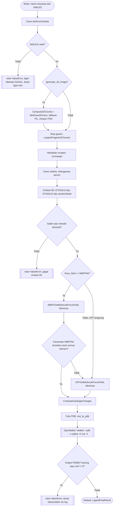

# Preparasi Ligan

Implementasi: `chemflow.chem.ligand_preparer.LigandPreparer`.

Gambar 2D diambil dari mol 2D asli hasil parsing SMILES, sebelum
minimisasi, bukan dari konformasi 3D yang sudah dioptimasi.

Catatan penting:

- Nama file gambar 2D, PDB, dan PDBQT diturunkan dari nama senyawa lewat
  `chemflow.utils.name_sanitizer.sanitize_filename`, sehingga aman di Windows:
  karakter terlarang, nama perangkat (`CON`, `NUL`, `COM1`, dst.), aksara
  non-Latin, dan tabrakan nama (termasuk beda huruf besar dan kecil)
  ditangani. `unique_safe_names` menjamin nama unik lintas seluruh ligan, dan
  `LigandRecord.safe_name` membawanya ke semua tahap. Panjang nama menyesuaikan
  panjang folder output agar path tetap di bawah 260 karakter di Windows.
- `-h` pada OpenBabel memicu penghitungan ulang muatan Gasteiger dan
  pembangunan pohon torsi (ROOT/BRANCH/ENDBRANCH/TORSDOF) secara internal
  saat menulis PDBQT ligan.
- OpenBabel bisa keluar dengan exit code 0 walau gagal diam-diam, sehingga
  ukuran file output ikut divalidasi, bukan hanya exit code.
- Setiap tahap mencatat kegagalan sebagai warning dan, kecuali tahap yang
  benar-benar fatal (parsing SMILES gagal), tidak menghentikan pipeline
  untuk ligan lain.
