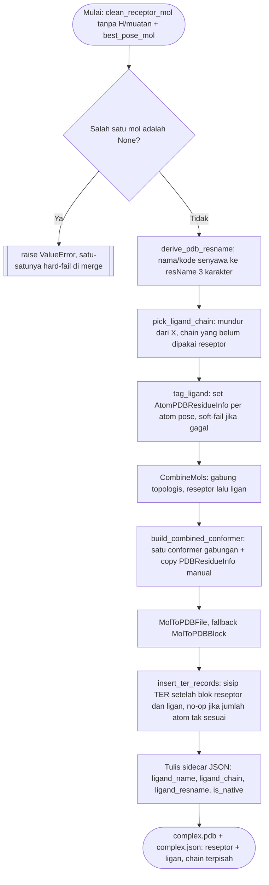
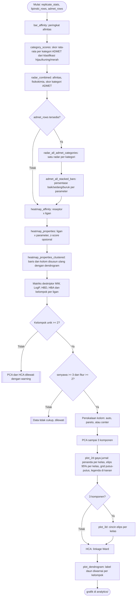

# Merge Kompleks dan Analitik

## Merge kompleks

Implementasi: `chemflow.docking.merge.merge_complex`.

Reseptor yang dipakai wajib versi `prepare_for_merge()` (tanpa H/muatan),
bukan PDBQT hasil `prepare_for_docking()` yang sudah ditambah H polar dan
muatan Kollman.

Sidecar JSON (nama file sama, ekstensi `.json`) mencatat identitas ligan
di kompleks itu, dipakai modul lain (analisis similaritas interaksi) untuk
mengenali sisi ligan tanpa parsing ulang struktur PDB.

### Mode merge: `best` vs `all`

Diatur lewat `PipelineConfig.merge_mode` (`--merge-mode` di CLI), default `"best"`.

- `best`: satu file `<ligan>_complex.pdb` per pasangan (ligan, reseptor),
  memakai pose dari replikat dengan afinitas terbaik secara global (bukan
  diasumsikan replikat pertama).
- `all`: satu file `<ligan>_rep<NN>_mode<NN>_complex.pdb` untuk setiap pose
  dari setiap replikat sukses, semuanya di-merge sebagai file terpisah.

### Kompleks referensi native

Ketika ligan native terdeteksi (`include_native=True`, default, atau
`run_rmsd_validation=True`), pipeline juga merge pose kristalografi asli ligan native (bukan hasil docking, via
`NativeLigand.to_pdb_block()`) ke file `NATIVE_<label>_complex.pdb`, dengan
`is_native: true` di sidecar-nya. File ini jadi baseline pembanding untuk
analisis similaritas interaksi (lihat `similarity-analysis.md`).

## Analitik

Implementasi: `chemflow.analytics.charts.ChartBuilder`,
`chemflow.analytics.heatmap.HeatmapBuilder`,
`chemflow.analytics.pca.ChemometricPCA`,
`chemflow.analytics.hca.HierarchicalClustering`. Gaya visual bersama ada di
`chemflow.analytics.style`.

PCA dan HCA memakai matriks deskriptor yang sama sehingga saling melengkapi:
PCA menunjukkan sumbu variansi utama, HCA menunjukkan struktur hierarkis
kemiripan antar senyawa.

### PCA gaya jurnal

Grafik PCA mengikuti gaya kemometrik yang lazim di jurnal (mis. Aghoutane et al. 2023,
*Micromachines* 14(3):524, Gambar 5):

- **Warna menandai seri** (mis. jenis parfum) dan **bentuk penanda menandai kelas** (mis. asli
  atau tiruan). Tanpa seri, warna mengikuti kelas.
- **Elips kepercayaan 95%** (chi-kuadrat, 2 derajat kebebasan) dilingkarkan per kelas pada plot
  2D dan sebagai cincin pada bidang dua sumbu utama sebaran kelas pada plot 3D. Elips butuh
  minimal 3 titik per kelas.
- Grid putus-putus, bingkai penuh, legenda di kanan di luar area plot, dan sumbu berlabel dua
  desimal seperti `PC1 (76.71 %)`.
- Vektor loading digambar bila fitur tidak lebih dari 12, label titik ditulis bila sampel tidak
  lebih dari 40 dan tanpa seri.

`ChemometricPCA.compute` menerima `series` (warna) dan `scaling` (`auto` z-score, `pareto`, atau
`center`), keduanya opsional; pipeline docking memakai kelompok senyawa sebagai kelas dan `auto`.
PCA yang sama dipakai analisis GC-MS ([gcms-analysis.md](gcms-analysis.md)) dengan seri sebagai
warna dan kelas sebagai penanda.

### Gaya grafik

Seluruh grafik memakai palet kategorikal Okabe-Ito (aman untuk buta warna),
tipografi sans-serif, dan resolusi 300 dpi. `--dpi` mengubah resolusi dan
`--figure-formats svg pdf` menulis versi vektor berdampingan dengan PNG.
Gaya diterapkan lewat `rc_context` sehingga tidak mengubah pengaturan
matplotlib global milik pemanggil.

### Radar gabungan

Sumbu radar gabungan terdiri dari afinitas docking, MW, LogP, HBD, HBA, dan
skor rata-rata tiap kategori ADMET. Kriteria berbeda satuan dinormalisasi
min-max lintas ligan dan dibalik bila nilai kecil lebih baik, sehingga arah
baik selalu ke luar. Skor kategori ADMET sudah berskala 0 sampai 1 dan dipakai
apa adanya. Judul menyesuaikan data yang benar-benar dipakai: kata "ADMET"
hanya muncul bila ada data ADMET, sehingga run dengan `--no-admet` menghasilkan
judul "Profil Gabungan: Fisikokimia + ΔG".

Radar gabungan memuat satu garis per ligan, memakai reseptor dengan afinitas
terbaik untuk ligan itu. Ligan diurutkan menurut ΔG lalu dibagi ke beberapa radar
berisi delapan garis (maksimal lima radar, `_part01of05`); judul mencantumkan
peringkat yang ditampilkan, dan normalisasi dihitung dari semua ligan supaya antar-radar
sebanding. Ligan native disematkan di setiap radar (garis putus-putus merah muda).

Pada run multi-reseptor, label ligan ditambah nama reseptor agar entri dengan
nama ligan sama tidak saling menimpa pada bar, dan agar reseptor terbaik tiap
ligan terbaca pada radar.

### Radar dan bar klasifikasi per kategori ADMET

`radar_by_category()` menggambar satu radar per kategori (Absorpsi, Distribusi,
Metabolisme, Toksisitas). Tiap parameter diubah ke skor klasifikasi (baik 1,
sedang 0,5, buruk 0) dan ligan diurutkan menurut rata-rata skor, lalu dibagi ke
beberapa radar berisi delapan ligan (native disematkan). Kategori dengan lebih dari 12
parameter dibatasi ke 12 parameter dengan variasi skor terbesar antar ligan
supaya radar tetap terbaca. Judul mencantumkan pembatasan ligan atau parameter
yang berlaku. Kategori dengan kurang dari 3 parameter terskor (mis. Ekskresi)
tidak diberi radar.

`admet_stacked_bar()` melengkapinya dengan bar 100% per parameter yang
menampilkan persentase ligan baik, sedang, dan buruk, untuk semua kategori
termasuk Fisikokimia.

### Heatmap terklaster

`HeatmapBuilder.heatmap_clustered()` menggambar heatmap dengan dendrogram
hierarchical clustering pada baris dan/atau kolom, memakai
`scipy.cluster.hierarchy.linkage`. Baris dan kolom disusun ulang menurut
hasil clustering. Matriks harus lengkap tanpa nilai kosong, dan sumbu dengan
kurang dari 3 anggota tidak di-cluster. `heatmap_properties_clustered()` adalah
versi siap pakai untuk data ligan x parameter, dengan z-score sebelum clustering.

## Ligan native dan analitik per grup

Ligan native (grup **Native**) ikut di semua analitik agar ligan uji bisa dibandingkan
dengan referensinya: sheet Excel, bar afinitas (batang merah muda, garis ΔG native bila satu
reseptor), heatmap afinitas (kolom "Native (ref)" ikut di setiap ubin: tiap reseptor
dibandingkan dengan native-nya sendiri), PCA, HCA, dan radar. Sheet statistik replikasi mendapat
kolom `delta_vs_native` (ΔG dikurangi ΔG native pada reseptor yang sama). Karena "Native" menjadi
kelompok kedua, PCA dan HCA juga jalan pada studi yang hanya punya satu grup ligan uji.

Implementasi: `chemflow.analytics.group_stats` (agregasi murni) dan
`chemflow.analytics.group_charts.GroupChartBuilder`. Ligan yang sama di beberapa grup dihitung
di tiap grup menurut keanggotaannya (ADMET-nya identik: satu prediksi disalin).

| Grafik | Pertanyaan yang dijawab |
|---|---|
| `grup_afinitas_box` | Grup mana yang ΔG-nya lebih baik pada tiap reseptor, dibanding ΔG native (garis putus-putus) |
| `grup_heatmap_afinitas` | ΔG rata-rata reseptor x grup, kolom Native sebagai referensi |
| `grup_heatmap_lebih_baik_dari_native` | Berapa persen ligan tiap grup yang ΔG-nya sama atau lebih baik dari native |
| `grup_admet_ringkasan`, `grup_admet_heatmap_<kategori>` | Skor ADMET rata-rata (baik 1, sedang 0,5, buruk 0) per grup x kategori dan grup x parameter |
| `grup_admet_radar_<kategori>` | Profil parameter satu kategori, satu garis per grup |
| `grup_admet_klasifikasi_<kategori>` | Persentase baik/sedang/buruk per parameter, satu panel per grup |
| `grup_fisikokimia_box` | Sebaran MW, LogP, HBD, HBA per grup |
| `grup_radar_gabungan` | Profil gabungan ΔG + fisikokimia + ADMET, satu garis per grup |

Sheet Excel tambahan: "Ringkasan per Grup" (jumlah ligan, rata-rata fisikokimia, persen lolos Ro5,
skor ADMET per kategori) dan "Docking per Grup" (ΔG per reseptor x grup, ΔG native, persen ligan yang
lebih baik dari native). Kolom `group` ditambahkan ke sheet ligan, docking, Lipinski, ADMET, dan statistik.

## Pemotongan otomatis grafik besar

Grafik yang memuat banyak ligan, reseptor, atau parameter dibagi menjadi beberapa gambar
(`chemflow.analytics.paging`) supaya label dan sel tetap terbaca. Nama file bagian berakhiran
`_part02of03`; bila cukup satu gambar, nama file tidak berubah.

- `paginate(n, max_items)` membagi seimbang (25 item dengan batas 20 menjadi 13 + 12, bukan 20 + 5).
  `paginate_grid` membuat ubin baris x kolom berurutan baris demi baris.
- Batas: `plot_max_rows` (default 30) untuk ligan, baris, dan bar; `plot_max_cols` (default 20) untuk
  kolom heatmap; `0` menonaktifkan. Radar per-ligan selalu dibagi delapan garis dengan maksimal lima
  bagian (di luar `plot_max_rows`); panel grup dan reseptor dibagi empat sampai enam per gambar.
- Skala warna, sumbu x, z-score, dan normalisasi radar dihitung dari seluruh data sebelum dipotong,
  sehingga antar-bagian sebanding. Bar diurutkan (bagian 1 = terbaik).
- Heatmap terklaster: klaster dihitung sekali pada matriks penuh lalu diiris. Tiap ubin menampilkan
  potongan dendrogram penuh yang sama pada jendela barisnya (daun ke-k berada di posisi 10k+5), dan
  dendrogram HCA memakai jendela daun yang sama.
- Metode grafik mengembalikan `List[Path]` (kosong bila dilewati), bukan `Optional[Path]`.
