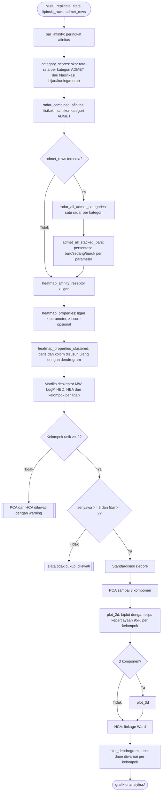

# Merge Kompleks dan Analitik

## Merge kompleks

Implementasi: `chemflow.docking.merge.merge_complex`.

Reseptor yang dipakai wajib versi `prepare_for_merge()` (tanpa H/muatan),
bukan PDBQT hasil `prepare_for_docking()` yang sudah ditambah H polar dan
muatan Kollman.

Sidecar JSON (nama file sama, ekstensi `.json`) mencatat identitas ligan
di kompleks itu, dipakai modul lain (analisis similaritas interaksi) untuk
mengenali sisi ligan tanpa parsing ulang struktur PDB.

### Mode merge: `best` vs `all`

Diatur lewat `PipelineConfig.merge_mode` (`--merge-mode` di CLI), default `"best"`.

- `best`: satu file `<ligan>_complex.pdb` per pasangan (ligan, reseptor),
  memakai pose dari replikat dengan afinitas terbaik SECARA GLOBAL (bukan
  diasumsikan replikat pertama).
- `all`: satu file `<ligan>_rep<NN>_mode<NN>_complex.pdb` untuk SETIAP pose
  dari SETIAP replikat sukses, semuanya di-merge sebagai file terpisah.

### Kompleks referensi native

Ketika `run_rmsd_validation=True` dan ligan native terdeteksi, pipeline
juga merge pose kristalografi ASLI ligan native (bukan hasil docking, via
`NativeLigand.to_pdb_block()`) ke file `NATIVE_<label>_complex.pdb`, dengan
`is_native: true` di sidecar-nya. File ini jadi baseline pembanding untuk
analisis similaritas interaksi (lihat `similarity-analysis.md`).

## Analitik

Implementasi: `chemflow.analytics.charts.ChartBuilder`,
`chemflow.analytics.heatmap.HeatmapBuilder`,
`chemflow.analytics.pca.ChemometricPCA`,
`chemflow.analytics.hca.HierarchicalClustering`. Gaya visual bersama ada di
`chemflow.analytics.style`.

PCA dan HCA memakai matriks deskriptor yang sama sehingga saling melengkapi:
PCA menunjukkan sumbu variansi utama, HCA menunjukkan struktur hierarkis
kemiripan antar senyawa.

### Gaya grafik

Seluruh grafik memakai palet kategorikal Okabe-Ito (aman untuk buta warna),
tipografi sans-serif, dan resolusi 300 dpi. `--dpi` mengubah resolusi dan
`--figure-formats svg pdf` menulis versi vektor berdampingan dengan PNG.
Gaya diterapkan lewat `rc_context` sehingga tidak mengubah pengaturan
matplotlib global milik pemanggil.

### Radar gabungan

Sumbu radar gabungan terdiri dari afinitas docking, MW, LogP, HBD, HBA, dan
skor rata-rata tiap kategori ADMET. Kriteria berbeda satuan dinormalisasi
min-max lintas ligan dan dibalik bila nilai kecil lebih baik, sehingga arah
baik selalu ke luar. Skor kategori ADMET sudah berskala 0 sampai 1 dan dipakai
apa adanya. Judul menyesuaikan data yang benar-benar dipakai: kata "ADMET"
hanya muncul bila ada data ADMET, sehingga run dengan `--no-admet` menghasilkan
judul "Profil Gabungan: Fisikokimia + ΔG".

Radar gabungan memuat satu garis per ligan, memakai reseptor dengan afinitas
terbaik untuk ligan itu, dan menampilkan enam ligan dengan ΔG terbaik. Bila
jumlah ligan melebihi enam, judul mencantumkan berapa yang ditampilkan.

Pada run multi-reseptor, label ligan ditambah nama reseptor agar entri dengan
nama ligan sama tidak saling menimpa pada bar, dan agar reseptor terbaik tiap
ligan terbaca pada radar.

### Radar dan bar klasifikasi per kategori ADMET

`radar_by_category()` menggambar satu radar per kategori (Absorpsi, Distribusi,
Metabolisme, Toksisitas). Tiap parameter diubah ke skor klasifikasi (baik 1,
sedang 0,5, buruk 0) dan ligan diurutkan menurut rata-rata skor. Radar
menampilkan delapan ligan dengan skor tertinggi. Kategori dengan lebih dari 12
parameter dibatasi ke 12 parameter dengan variasi skor terbesar antar ligan
supaya radar tetap terbaca. Judul mencantumkan pembatasan ligan atau parameter
yang berlaku. Kategori dengan kurang dari 3 parameter terskor (mis. Ekskresi)
tidak diberi radar.

`admet_stacked_bar()` melengkapinya dengan bar 100% per parameter yang
menampilkan persentase ligan baik, sedang, dan buruk, untuk semua kategori
termasuk Fisikokimia.

### Heatmap terklaster

`HeatmapBuilder.heatmap_clustered()` menggambar heatmap dengan dendrogram
hierarchical clustering pada baris dan/atau kolom, memakai
`scipy.cluster.hierarchy.linkage`. Baris dan kolom disusun ulang menurut
hasil clustering. Matriks harus lengkap tanpa nilai kosong, dan sumbu dengan
kurang dari 3 anggota tidak di-cluster. `heatmap_properties_clustered()` adalah
versi siap pakai untuk data ligan x parameter, dengan z-score sebelum clustering.
