# Alur Utama Pipeline

Urutan tahap yang dijalankan `Pipeline.run()`. Setiap kegagalan pada satu
ligan atau reseptor dicatat sebagai warning/error dan tidak menghentikan
seluruh run; sisanya tetap diproses.

```mermaid
flowchart TD
    Start([Mulai]) --> Banner[Cetak header ASCII-art chemflow]
    Banner --> ParseCfg[Parse argumen CLI ke PipelineConfig]
    ParseCfg --> Setup[Setup logging dan struktur direktori output]
    Setup --> ReadLig[/Baca Excel Ligan: tidy atau wide, auto-detect/]
    ReadLig --> MissingSmiles{Ada SMILES kosong?}
    MissingSmiles -->|Ya| PubChem[Resolusi PubChem per senyawa]
    MissingSmiles -->|Tidak| PrepLig
    PubChem --> PrepLig[["Preparasi Ligan (lihat ligand-preparation.md)"]]
    PrepLig --> Lipinski[Hitung Lipinski Ro5 per ligan]
    Lipinski --> RunAdmet{run_admet?}
    RunAdmet -->|Ya| AdmetSource{admet_file diisi?}
    AdmetSource -->|Ya| AdmetFile[Baca CSV/Excel ADMETLab3, petakan baris ke ligan secara posisional]
    AdmetSource -->|Tidak| Admet[Scraping ADMETLab3 per batch dengan retry]
    RunAdmet -->|Tidak| ReadRec
    AdmetFile --> ReadRec
    Admet --> ReadRec[/Baca Excel Reseptor: kode PDB + gridbox opsional/]
    ReadRec --> PrepRec[["Preparasi Reseptor per baris (lihat receptor-preparation.md)"]]
    PrepRec --> ResolveVina[["Resolusi executable Vina (lihat docking.md)"]]
    ResolveVina --> DockMatrix[["Matriks Docking: ligan x reseptor x replikat (lihat docking.md)"]]
    DockMatrix --> RunRmsd{run_rmsd_validation dan ada ligan native?}
    RunRmsd -->|Ya| Rmsd[["Validasi RMSD Redocking (lihat rmsd-validation.md)"]]
    RunRmsd -->|Tidak| Merge
    Rmsd --> Merge[["Merge pose terbaik + reseptor bersih (lihat merge-and-analytics.md)"]]
    Merge --> Export[/Ekspor hasil_chemflow.xlsx: sheet kondisional/]
    Export --> Charts{generate_charts?}
    Charts -->|Ya| BarRadar[Bar, radar, dan bar klasifikasi ADMET]
    Charts -->|Tidak| Heatmap
    BarRadar --> Heatmap{run_heatmap?}
    Heatmap -->|Ya| HeatmapGen[Heatmap afinitas dan fisikokimia]
    Heatmap -->|Tidak| Pca
    HeatmapGen --> Pca{run_pca?}
    Pca -->|Ya| PcaGen[PCA kemometrik 2D dan 3D]
    Pca -->|Tidak| Hca
    PcaGen --> Hca{run_hca?}
    Hca -->|Ya| HcaGen[Dendrogram HCA]
    Hca -->|Tidak| End
    HcaGen --> End([Selesai, return code 0 atau 1])
```

## Ringkasan tahap

| Tahap | Modul | Keterangan |
|---|---|---|
| Header CLI | `banner` | Logo ASCII-art, versi, dan tagline dicetak di awal setiap perintah CLI (termasuk `--help`), sebelum argumen di-parse. Tidak dicetak saat dipakai sebagai library |
| Baca ligan | `io.excel_ligands` | Auto-detect format tidy atau wide |
| Resolusi SMILES | `chem.pubchem_client` | PubChem, dengan fallback input manual interaktif |
| Preparasi ligan | `chem.ligand_preparer` | MMFF94/UFF, Gasteiger, render 2D, PDBQT |
| Fisikokimia | `chem.descriptors` | Lipinski Rule of Five |
| ADMET | `admet.admetlab_scraper`, `admet.admet_file`, `admet.admet_rules` | Scraping ADMETLab3 dengan retry, atau file CSV/Excel hasil unduhan; klasifikasi hijau/kuning/merah |
| Susun Excel reseptor (opsional, sebelum run) | `io.receptor_config` | Interaktif: kode PDB, pilih ligan native, pusat dan ukuran kotak otomatis (lihat receptor-config.md) |
| Baca reseptor | `io.excel_receptors` | Kode PDB wajib, gridbox opsional |
| Preparasi reseptor | `chem.receptor_preparer` | Kollman charge, tipe atom AD4, PDBQT rigid |
| Resolusi Vina | `docking.vina_manager` | Auto-download sesuai OS/arsitektur |
| Docking | `docking.docking_matrix` | Multi-reseptor, multi-situs, multi-replikasi |
| Validasi RMSD | `docking.rmsd_validation` | Redocking ligan native vs kristalografi |
| Merge | `docking.merge` | Pose terbaik + reseptor bersih |
| Analitik | `analytics.charts`, `analytics.heatmap`, `analytics.pca`, `analytics.hca`, `analytics.style` | Bar, radar, heatmap, PCA 2D/3D, dendrogram HCA, gaya grafik bersama |
