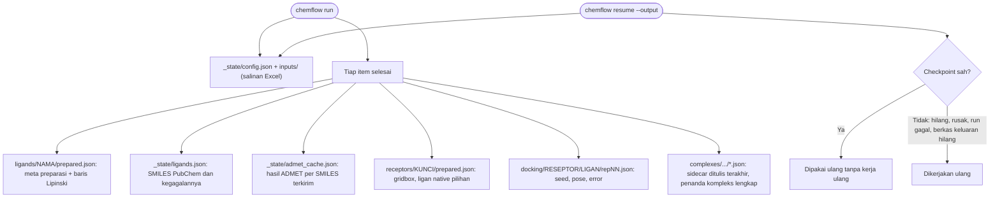

# Alur Utama Pipeline

Urutan tahap yang dijalankan `Pipeline.run()`. Setiap kegagalan pada satu
ligan atau reseptor dicatat sebagai warning/error dan tidak menghentikan
seluruh run; sisanya tetap diproses.

```mermaid
flowchart TD
    Start([Mulai]) --> Banner[Cetak header ASCII-art chemflow]
    Banner --> ParseCfg[Parse argumen CLI ke PipelineConfig]
    ParseCfg --> Setup[Setup logging dan struktur direktori output]
    Setup --> Begin{resume?}
    Begin -->|Tidak| SaveCfg[Simpan config dan salinan Excel input ke _state/, hapus checkpoint lama]
    Begin -->|Ya| LoadCfg[Muat config dan salinan input dari _state/, muat cache ADMET]
    SaveCfg --> ReadLig
    LoadCfg --> ReadLig[/Baca Excel Ligan: tidy atau wide, auto-detect/]
    ReadLig --> MissingSmiles{Ada SMILES kosong?}
    MissingSmiles -->|Ya| PubChem[Resolusi PubChem per senyawa]
    MissingSmiles -->|Tidak| PrepLig
    PubChem --> PrepLig[["Preparasi Ligan (lihat ligand-preparation.md)"]]
    PrepLig --> Lipinski[Hitung Lipinski Ro5 per ligan]
    Lipinski --> RunAdmet{run_admet?}
    RunAdmet -->|Ya| AdmetSource{admet_file diisi?}
    AdmetSource -->|Ya| AdmetFile[Baca CSV/Excel ADMETLab3, petakan posisional atau per SMILES unik lalu salin ke ligan kembar]
    AdmetSource -->|Tidak| Admet[Kirim SMILES unik ke ADMETLab3 per batch dengan retry, salin hasil ke ligan kembar, simpan cache]
    RunAdmet -->|Tidak| ReadRec
    AdmetFile --> ReadRec
    Admet --> ReadRec[/Baca Excel Reseptor: kode PDB + gridbox opsional/]
    ReadRec --> PrepRec[["Preparasi Reseptor per baris (lihat receptor-preparation.md)"]]
    PrepRec --> ResolveVina[["Resolusi executable Vina (lihat docking.md)"]]
    ResolveVina --> DockMatrix[["Matriks Docking: ligan x reseptor x replikat (lihat docking.md)"]]
    DockMatrix --> Natives[["Ligan native: SMILES, preparasi, Lipinski, ADMET, redocking ke reseptornya (lihat rmsd-validation.md)"]]
    Natives --> RunRmsd{run_rmsd_validation dan ada ligan native?}
    RunRmsd -->|Ya| Rmsd[["Validasi RMSD dari pose terbaik redocking native (lihat rmsd-validation.md)"]]
    RunRmsd -->|Tidak| Merge
    Rmsd --> Merge[["Merge pose terbaik + reseptor bersih (lihat merge-and-analytics.md)"]]
    Merge --> Export[/Ekspor hasil_chemflow.xlsx: sheet kondisional/]
    Export --> Charts{generate_charts?}
    Charts -->|Ya| BarRadar[Bar, radar, bar klasifikasi ADMET, dan grafik per grup, dipotong otomatis bila besar]
    Charts -->|Tidak| Heatmap
    BarRadar --> Heatmap{run_heatmap?}
    Heatmap -->|Ya| HeatmapGen[Heatmap afinitas dan fisikokimia]
    Heatmap -->|Tidak| Pca
    HeatmapGen --> Pca{run_pca?}
    Pca -->|Ya| PcaGen[PCA kemometrik 2D dan 3D]
    Pca -->|Tidak| Hca
    PcaGen --> Hca{run_hca?}
    Hca -->|Ya| HcaGen[Dendrogram HCA]
    Hca -->|Tidak| Sim
    HcaGen --> Gcms{gcms_data diisi?}
    Gcms -->|Ya| GcmsRun[["Analisis GC-MS opsional, kegagalan hanya peringatan (lihat gcms-analysis.md)"]]
    Gcms -->|Tidak| Sim
    GcmsRun --> Sim{Similaritas: run_similarity True, atau None dan Windows serta BIOVIA terdeteksi?}
    Sim -->|Ya| Biovia[["Ekspor interaksi lewat GUI BIOVIA dengan mouse dan keyboard terkunci, lalu similaritas (lihat biovia-interactions.md)"]]
    Sim -->|Tidak, log menyebut penyebabnya| End
    Biovia --> End([Selesai, return code 0, 1, atau 130 bila Ctrl+C atau Esc tiga kali])
```

## Ringkasan tahap

| Tahap | Modul | Keterangan |
|---|---|---|
| Header CLI | `banner` | Logo ASCII-art, versi, dan tagline dicetak di awal setiap perintah CLI (termasuk `--help`), sebelum argumen di-parse. Tidak dicetak saat dipakai sebagai library |
| Baca ligan | `io.excel_ligands` | Auto-detect format tidy atau wide |
| Resolusi SMILES | `chem.pubchem_client` | PubChem, dengan fallback input manual interaktif |
| Preparasi ligan | `chem.ligand_preparer` | MMFF94/UFF, Gasteiger, render 2D, PDBQT |
| Fisikokimia | `chem.descriptors` | Lipinski Rule of Five |
| ADMET | `admet.admetlab_scraper`, `admet.admet_file`, `admet.admet_rules` | Scraping ADMETLab3 dengan retry, atau file CSV/Excel hasil unduhan; klasifikasi hijau/kuning/merah |
| Susun Excel reseptor (opsional, sebelum run) | `io.receptor_config` | Interaktif: kode PDB, pilih ligan native, pusat dan ukuran kotak otomatis (lihat receptor-config.md) |
| Baca reseptor | `io.excel_receptors` | Kode PDB wajib, gridbox opsional |
| Preparasi reseptor | `chem.receptor_preparer` | Kollman charge, tipe atom AD4, PDBQT rigid |
| Resolusi Vina | `docking.vina_manager` | Auto-download sesuai OS/arsitektur |
| Docking | `docking.docking_matrix` | Multi-reseptor, multi-situs, multi-replikasi |
| Validasi RMSD | `docking.rmsd_validation` | RMSD pose redocking native terhadap kristalografi, pada posisi asli tanpa superposisi (`CalcRMS`) |
| Merge | `docking.merge` | Pose terbaik + reseptor bersih |
| Ligan native | `pipeline` (`NativeEntry`), `io.ligand_template` | SMILES dari RCSB, preparasi seperti ligan uji, Lipinski, ADMET, redocking; grup "Native" di semua analitik |
| Analitik | `analytics.charts`, `analytics.heatmap`, `analytics.pca`, `analytics.hca`, `analytics.style` | Bar, radar, heatmap, PCA 2D/3D, dendrogram HCA, gaya grafik bersama |
| Analitik per grup | `analytics.group_stats`, `analytics.group_charts` | Perbandingan ADMET, ΔG, dan fisikokimia antar-grup dengan native sebagai pembanding |
| Pemotongan grafik | `analytics.paging` | Halaman seimbang dan ubin baris x kolom, akhiran `_part01of03` |
| Resume | `state`, `checkpoints` | Checkpoint atomik per item, `chemflow resume --output` |
| Interaksi BIOVIA | `interaction.biovia_install`, `interaction.biovia_gui`, `interaction.input_lock`, `interaction.exporter`, `interaction.table` | Otomatis di Windows bila BIOVIA terdeteksi (`--no-similarity` mematikan): diagram 2D dan tabel Non-bond tiap kompleks lewat GUI BIOVIA dengan mouse dan keyboard terkunci, lalu `similarity.report` |
| Analisis GC-MS | `gcms.readers`, `gcms.processing`, `gcms.stats`, `gcms.library`, `gcms.plots`, `gcms.analysis` | Opsional (`--gcms`, atau `chemflow gcms` tanpa docking): kromatogram, puncak, PCA gaya jurnal, PLS-DA, uji univariat, skrining alergen |

## Resume dan checkpoint

Setiap item yang selesai langsung ditulis sebagai checkpoint JSON secara atomik
(tulis ke berkas sementara lalu `os.replace`), sehingga terminal ditutup, Ctrl+C,
atau komputer mati tidak pernah meninggalkan JSON setengah jadi. Path di dalam
checkpoint relatif terhadap folder output, jadi folder boleh dipindah.

Aturan: run Vina yang sukses dan PDBQT-nya masih ada dipakai ulang (seed asli
dipertahankan); run yang gagal atau terputus di tengah dijalankan ulang;
reseptor yang sudah punya checkpoint tidak menanyakan gridbox lagi; SMILES
PubChem yang sudah diputuskan (termasuk yang dilewati) tidak dicari atau
ditanyakan ulang; kompleks dilewati bila PDB dan sidecar JSON-nya lengkap dan
berasal dari run yang dipakai ulang. Laporan Excel dan grafik selalu dibuat ulang,
sehingga `resume` pada run yang sudah selesai hanya meregenerasi keduanya.
`chemflow run` baru ke folder yang sama menghapus checkpoint lama (hasil docking,
ligan, dan reseptor tidak dihapus) agar tak tercampur.

`stream_process` mematikan proses Vina anak bila terinterupsi (Ctrl+C), karena
proses dengan konsol tersembunyi tidak menerima sinyal itu dan akan menjadi
proses yatim yang terus menulis keluaran. `Pipeline.run()` mengembalikan 130 dan
mencetak perintah `chemflow resume`.
