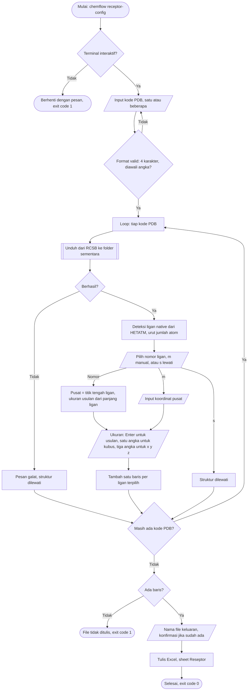

# Konfigurasi Reseptor Interaktif

Implementasi: `chemflow.io.receptor_config`, dipanggil oleh `chemflow receptor-config`.

Subperintah ini menyusun Excel reseptor sebelum `chemflow run`. Pengguna hanya
memasukkan kode PDB dan memilih ligan native. Pusat dan ukuran kotak docking
dihitung dari koordinat ligan itu. Perintah ini tidak punya opsi dan hanya
berjalan di terminal interaktif.



## Aturan masukan

| Masukan | Aturan |
|---|---|
| Kode PDB | Empat karakter alfanumerik dengan karakter pertama angka. Dipisah spasi, koma, atau titik koma. Huruf kecil diubah menjadi besar dan duplikat dihapus. |
| Pilihan ligan | Satu atau beberapa nomor dari tabel (`1 2`), `m` untuk koordinat manual, `s` untuk melewati struktur. Beberapa nomor menghasilkan beberapa baris (multi-situs). |
| Ukuran kotak | Kosong memakai ukuran usulan, satu angka membuat kubus, tiga angka menentukan `x y z`. Angka harus positif, desimal boleh memakai titik atau koma. |
| Nama file | Default `reseptor.xlsx`. Ekstensi `.xlsx` ditambahkan bila belum ada. File yang sudah ada hanya ditimpa setelah dikonfirmasi. |

## Pusat dan ukuran kotak

Pusat kotak adalah rata-rata koordinat atom ligan yang dipilih, dibulatkan ke
tiga desimal. Ukuran usulan dihitung dari sisi bounding-box terpanjang ligan
(`NativeLigand.extent`) lewat `GridBox.cube_for_extent`:

```
ukuran = min(ceil(max(panjang + 8, 18)), 30)   Angstrom
```

Ruang tambahan 8 Angstrom memberi ligan uji ruang berputar, batas bawah 18
mencegah kotak terlalu sempit untuk ligan kecil atau ion, dan batas atas 30
mengikuti batas volume pencarian yang disarankan AutoDock Vina. Ukuran yang
diketik pengguna tidak dibatasi.

## Format keluaran

Satu sheet `Reseptor` dengan kolom berikut. Kolom yang dikenali `io.excel_receptors`
langsung terbaca oleh `chemflow run --receptors`.

| Kolom | Isi |
|---|---|
| `pdb_code` | Kode PDB huruf besar. Muncul lebih dari sekali untuk multi-situs. |
| `center_x`, `center_y`, `center_z` | Pusat kotak (Angstrom). |
| `size_x`, `size_y`, `size_z` | Ukuran kotak (Angstrom). |
| `native_ligand` | Label ligan asal (`RESNAME_ChainResnum`) atau `manual`. Catatan saja, tidak dibaca chemflow. |

Pada `chemflow run --run-rmsd-validation`, ligan native dipilih sebagai yang
paling dekat dengan pusat kotak, sehingga selalu ligan yang dipilih di sini.
