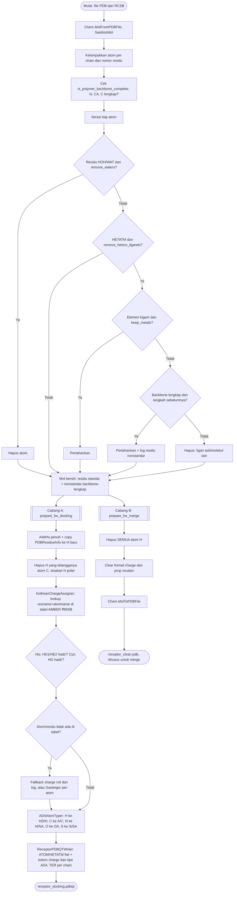

# Preparasi Reseptor

Implementasi: `chemflow.chem.receptor_preparer.ReceptorPreparer`.

Dua jalur keluaran yang sengaja dipisah total: `prepare_for_docking()`
menghasilkan PDBQT rigid dengan hidrogen polar dan muatan Kollman untuk
Vina, sementara `prepare_for_merge()` menghasilkan PDB bersih tanpa
hidrogen dan muatan sama sekali, khusus untuk penggabungan kompleks.

Residu HETATM yang secara struktural bagian dari backbone protein (asam
amino termodifikasi, misalnya MSE selenometionin) selalu dipertahankan
lewat pengecekan struktural, bukan daftar nama hardcode, sehingga
residu termodifikasi apa pun otomatis tergeneralisasi.
