# Validasi RMSD Redocking

Implementasi: `chemflow.docking.rmsd_validation.RedockingValidator`.

Kriteria RMSD lebih kecil dari 2.0 Angstrom antara pose redocking dan
ligan native kristalografi umum dipakai sebagai kriteria "baik" pada
validasi docking self-docking/redocking. Lihat Hevener et al. 2009,
*J. Chem. Inf. Model.* 49(2):444-460 (PMC2788795). Sebagian studi
memakai ambang lebih longgar (2.0-3.0 A sebagai "acceptable") atau
lebih ketat (1.5 A). Kedua ambang bisa dikonfigurasi via
`rmsd_threshold_good` dan `rmsd_threshold_acceptable`.

```mermaid
flowchart TD
    Start([Mulai: ligan native terpilih + koordinat kristalografi asli]) --> Extract[to_pdb_block: ekstrak blok PDB residu native, ground truth, tanpa modifikasi]
    Extract --> Template[Ambil SMILES templat komponen kimia dari RCSB, simpan di cache]
    Template --> AssignBonds[AssignBondOrdersFromTemplate: orde ikatan ke koordinat kristal]
    AssignBonds --> BondsOk{Templat cocok dengan atom kristal?}
    BondsOk -->|Ya| ToSmiles[MolToSmiles dari molekul bertopologi benar]
    BondsOk -->|Tidak| Fallback0[SMILES dari koordinat saja, dengan peringatan]
    Fallback0 --> ToSmiles
    ToSmiles --> PrepLikeScreening[["Siapkan ligan native persis seperti ligan screening (lihat ligand-preparation.md)"]]
    PrepLikeScreening --> Redock[["Redocking sebagai ligan referensi: run_matrix ke reseptornya sendiri, gridbox dan parameter sama, n_replicates sama dengan ligan uji"]]
    Redock --> RedockOk{Redocking sukses dan menghasilkan pose?}
    RedockOk -->|Tidak| FailRedock[["status = gagal, dicatat, reseptor lain tetap lanjut"]]
    RedockOk -->|Ya| BestPose[Ambil pose mode 1 dari replikat dengan afinitas terbaik]
    BestPose --> RemoveHs[RemoveHs pada pose dan native: bandingkan heavy-atom saja]
    RemoveHs --> CalcRms[rdMolAlign.CalcRMS: pada posisi asli tanpa superposisi, memperhitungkan simetri, atom-mapping otomatis]
    CalcRms --> CalcRmsOk{Berhasil? Graf molekul cocok}
    CalcRmsOk -->|Tidak| Fallback[["Fallback: pencocokan greedy per elemen dan jarak terdekat, RMSD tetap tanpa superposisi"]]
    CalcRmsOk -->|Ya| Threshold1{RMSD < rmsd_threshold_good?}
    Fallback --> FallbackOk{Kedua metode gagal total?}
    FallbackOk -->|Ya| FailBoth[["status = gagal, rmsd = None, tidak pernah raise ke pipeline utama"]]
    FallbackOk -->|Tidak| Threshold1
    Threshold1 -->|Ya| Good[status = good]
    Threshold1 -->|Tidak| Threshold2{RMSD < rmsd_threshold_acceptable?}
    Threshold2 -->|Ya| Acceptable[status = acceptable]
    Threshold2 -->|Tidak| Poor[status = poor]
    Good --> End([RmsdValidationResult: rmsd, status, metode, catatan])
    Acceptable --> End
    Poor --> End
```

## RMSD pada posisi asli

RMSD dihitung terhadap koordinat kristal pada posisi aslinya, tanpa superposisi
(`rdMolAlign.CalcRMS`, memperhitungkan simetri molekul, sehingga urutan atom setara
tidak mempengaruhi hasil). Pose Vina berada pada kerangka koordinat reseptor yang sama
dengan struktur kristal, jadi pose yang bentuknya benar tetapi bergeser di dalam kantong
ikat tetap terbaca buruk. Perhitungan yang menyelaraskan pose ke kristal lebih dulu
(`GetBestRMS`) hanya mengukur kemiripan bentuk dan menyembunyikan pergeseran itu.

Contoh dari satu run dengan Vina 1.2.7 (exhaustiveness 8) pada pose yang sama:

| Reseptor | Ligan native | Pada posisi asli (`CalcRMS`) | Setelah superposisi (`GetBestRMS`) |
|---|---|---|---|
| 1HSG | MK1 (indinavir) | 10,53 A | 4,05 A |
| 1UWH | BAX (sorafenib) | 0,57 A | 0,42 A |

Kolom `metode` sheet "Validasi RMSD" berisi `CalcRMS`, atau `fallback_greedy` bila graf
molekul pose dan native tidak cocok. Fallback memasangkan atom secara greedy menurut
elemen dan jarak terdekat tanpa memperhatikan topologi, jadi nilainya perkiraan yang
cenderung tidak lebih besar dari RMSD sebenarnya.

Koordinat kristal ligan pada PDB tidak memuat orde ikatan, sehingga SMILES
yang diturunkan langsung dari koordinat menghasilkan molekul jenuh yang salah
secara kimia. Karena itu SMILES ligan native diambil dari templat komponen
kimia RCSB (`chemflow.io.ligand_template`) dan orde ikatannya dipetakan ke
koordinat kristal. Templat disimpan di `_cache/ligand_templates/` sehingga
run berikutnya tidak mengunduh ulang. Jika templat tidak tersedia atau tidak
cocok, digunakan SMILES dari koordinat dan sebuah peringatan dicatat.

Afinitas hasil redocking (mode 1, replikat terbaik) dicatat pada kolom `redock_affinity`
sheet "Validasi RMSD" dan dipakai sebagai afinitas referensi pada analisis
similaritas interaksi (selisih ΔG).

## Ligan native sebagai ligan referensi

Redocking dijalankan sebagai bagian docking ligan referensi, bukan di dalam
validasi. Tiap ligan native diperlakukan sebagai ligan referensi (`NativeEntry`,
nama `NATIVE_<label>`):

1. SMILES diturunkan dari templat RCSB, lalu ligan disiapkan seperti ligan uji.
2. Di-dock ke reseptornya sendiri lewat `DockingOrchestrator.run_matrix`, dengan gridbox,
   `exhaustiveness`, `num_modes`, `energy_range`, seed dasar, dan `n_replicates` yang sama
   dengan ligan uji, sehingga ΔG-nya sebanding.
3. Lipinski dan ADMET-nya dihitung (ADMET ikut jalur SMILES unik).
4. Semuanya masuk ke sheet Excel dan seluruh analitik sebagai grup **Native**
   (`--no-native` mematikannya).
5. Validasi RMSD (`--run-rmsd-validation`) membaca pose terbaik hasil docking native itu
   (`docking/<kunci>/NATIVE_<label>/`).

Native untuk jalur Excel dipilih dari ligan terdekat dengan pusat kotak, paling jauh
`native_match_radius` (default 8 Angstrom); yang lebih jauh dianggap situs berbeda
(mis. alosterik) dan dilewati dengan peringatan. Hasil docking native tidak di-merge menjadi
kompleks karena namanya bentrok dengan kompleks kristal referensi `NATIVE_<label>_complex.pdb`.
Ligan native dengan label sama pada dua reseptor diberi akhiran kunci reseptor.
