# Validasi RMSD Redocking

Implementasi: `chemflow.docking.rmsd_validation.RedockingValidator`.

Kriteria RMSD lebih kecil dari 2.0 Angstrom antara pose redocking dan
ligan native kristalografi umum dipakai sebagai kriteria "baik" pada
validasi docking self-docking/redocking. Lihat Hevener et al. 2009,
*J. Chem. Inf. Model.* 49(2):444-460 (PMC2788795). Sebagian studi
memakai ambang lebih longgar (2.0-3.0 A sebagai "acceptable") atau
lebih ketat (1.5 A). Kedua ambang bisa dikonfigurasi via
`rmsd_threshold_good` dan `rmsd_threshold_acceptable`.

```mermaid
flowchart TD
    Start([Mulai: ligan native terpilih + koordinat kristalografi asli]) --> Extract[to_pdb_block: ekstrak blok PDB residu native, ground truth, tanpa modifikasi]
    Extract --> Template[Ambil SMILES templat komponen kimia dari RCSB, simpan di cache]
    Template --> AssignBonds[AssignBondOrdersFromTemplate: orde ikatan ke koordinat kristal]
    AssignBonds --> BondsOk{Templat cocok dengan atom kristal?}
    BondsOk -->|Ya| ToSmiles[MolToSmiles dari molekul bertopologi benar]
    BondsOk -->|Tidak| Fallback0[SMILES dari koordinat saja, dengan peringatan]
    Fallback0 --> ToSmiles
    ToSmiles --> PrepLikeScreening[["Siapkan ligan native persis seperti ligan screening (lihat ligand-preparation.md)"]]
    PrepLikeScreening --> Redock[["Redocking: jalankan Vina di gridbox yang sama dengan screening"]]
    Redock --> RedockOk{Redocking sukses dan menghasilkan pose?}
    RedockOk -->|Tidak| FailRedock[["status = gagal, dicatat, reseptor lain tetap lanjut"]]
    RedockOk -->|Ya| BestPose[Ambil pose terbaik: mode 1 dari PDBQT hasil redocking]
    BestPose --> RemoveHs[RemoveHs pada pose dan native: bandingkan heavy-atom saja]
    RemoveHs --> BestRms[rdMolAlign.GetBestRMS: symmetry-aware, auto atom-mapping]
    BestRms --> BestRmsOk{Berhasil? Formula molekul cocok}
    BestRmsOk -->|Tidak| Fallback[["Fallback: greedy nearest-atom match per elemen + superposisi Kabsch manual"]]
    BestRmsOk -->|Ya| Threshold1{RMSD < rmsd_threshold_good?}
    Fallback --> FallbackOk{Kedua metode gagal total?}
    FallbackOk -->|Ya| FailBoth[["status = gagal, rmsd = None, tidak pernah raise ke pipeline utama"]]
    FallbackOk -->|Tidak| Threshold1
    Threshold1 -->|Ya| Good[status = good]
    Threshold1 -->|Tidak| Threshold2{RMSD < rmsd_threshold_acceptable?}
    Threshold2 -->|Ya| Acceptable[status = acceptable]
    Threshold2 -->|Tidak| Poor[status = poor]
    Good --> End([RmsdValidationResult: rmsd, status, metode, catatan])
    Acceptable --> End
    Poor --> End
```

Koordinat kristal ligan pada PDB tidak memuat orde ikatan, sehingga SMILES
yang diturunkan langsung dari koordinat menghasilkan molekul jenuh yang salah
secara kimia. Karena itu SMILES ligan native diambil dari templat komponen
kimia RCSB (`chemflow.io.ligand_template`) dan orde ikatannya dipetakan ke
koordinat kristal. Templat disimpan di `_cache/ligand_templates/` sehingga
run berikutnya tidak mengunduh ulang. Jika templat tidak tersedia atau tidak
cocok, digunakan SMILES dari koordinat dan sebuah peringatan dicatat.

Afinitas hasil redocking (mode 1) dicatat pada kolom `redock_affinity` sheet
"Validasi RMSD" dan dipakai sebagai afinitas referensi pada analisis
similaritas interaksi (selisih ΔG).
