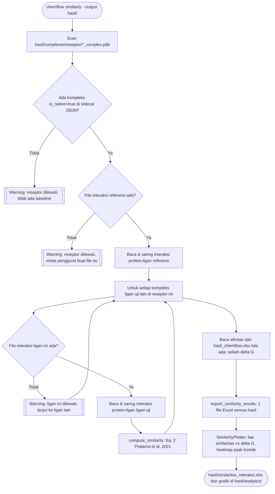

# Analisis Similaritas Interaksi

Fitur OPSIONAL (default tidak berjalan sebagai bagian `chemflow run`),
karena bergantung pada file Excel interaksi ligan-reseptor yang dibuat
MANUAL oleh pengguna lewat BIOVIA Discovery Studio Visualizer, setelah
proses docking selesai. Bisa di-rerun kapan saja pada folder output
`chemflow run` yang sudah ada, tanpa perlu docking ulang.

Metode perhitungan: Pratama et al. (2021), "Introducing a two-dimensional
graph of docking score difference vs. similarity of ligand-receptor
interactions", *Indonesian Journal of Biotechnology* 26(1):54-60,
DOI [10.22146/ijbiotech.62194](https://doi.org/10.22146/ijbiotech.62194).

## Prasyarat

1. Jalankan `chemflow run` dengan `--run-rmsd-validation` (butuh ligan
   native terdeteksi di struktur PDB reseptor), supaya pipeline juga
   menghasilkan kompleks referensi native (`NATIVE_<label>_complex.pdb`
   di `complexes/<reseptor>/`, lihat `merge-and-analytics.md`).
2. Buka SETIAP file `.pdb` di `complexes/<reseptor>/` (baik referensi
   native maupun ligan uji) satu per satu di BIOVIA Discovery Studio
   Visualizer, jalankan analisis interaksi ligan-reseptornya, lalu
   export tabel interaksi itu ke Excel.

## Konvensi penamaan file interaksi

Untuk setiap file kompleks `complexes/<reseptor>/<basis>.pdb`, file
interaksi hasil export BIOVIA harus disimpan di:

```
<interactions_dir>/<reseptor>/<basis>_interaksi.xlsx
```

`<interactions_dir>` default adalah `<output>/interaksi` (bisa diubah
lewat `--interactions-dir`), akhiran `_interaksi.xlsx` bisa diubah lewat
`--interaction-suffix`. Struktur folder `<interactions_dir>` MEMBAYANGI
struktur `complexes/` persis (satu subfolder per reseptor).

Contoh, untuk reseptor `6LU7` dengan native `NATIVE_ASP_X1_complex.pdb`
dan ligan uji `Quercetin_complex.pdb`:

```
hasil/
  complexes/
    6LU7/
      NATIVE_ASP_X1_complex.pdb
      NATIVE_ASP_X1_complex.json
      Quercetin_complex.pdb
      Quercetin_complex.json
  interaksi/
    6LU7/
      NATIVE_ASP_X1_complex_interaksi.xlsx   <- dibuat manual dari BIOVIA
      Quercetin_complex_interaksi.xlsx        <- dibuat manual dari BIOVIA
```

## Format file interaksi (export BIOVIA)

Export BIOVIA bersifat posisional (tanpa header baku): Name, Rendered,
Color, Style, ID, Category, Type/Subtype, From, From Chemistry, To,
To Chemistry, lalu opsional Distance/Angle. Hanya 11 kolom pertama
(sampai "To Chemistry") yang dijamin selalu ada dan dipakai; kolom
sesudahnya diabaikan karena BIOVIA kadang tidak menampilkannya. Baris
intra-ligand (kedua sisi chain ligan) dan intra-protein (kedua sisi chain
protein) otomatis disaring, hanya interaksi protein-ligan murni yang dipakai.

## Menjalankan analisis

```bash
python -m chemflow similarity --output hasil/
```

Opsi tambahan: `--no-plots` (lewati grafik), `--dpi N`, dan
`--figure-formats png svg pdf` (PNG selalu ditulis).



Setiap kegagalan per-file (file belum dibuat, kolom tidak lengkap, format
tidak dikenali) hanya melewati pasangan/reseptor itu dengan warning yang
jelas (menyebut nama file & path yang diharapkan), tidak menggagalkan
seluruh analisis. Ini disengaja karena file interaksi memang dibuat
bertahap oleh pengguna satu per satu di BIOVIA.

## Rumus similaritas (Persamaan 2, Pratama et al. 2021)

```
%similarity = (0.5 * (nAAtest / nAAref) + 0.5 * (intAAtest / intAAref)) * 100%
```

- `nAAtest / nAAref`: rasio jumlah residu (identitas posisi+nama saja)
  yang berinteraksi dengan ligan uji DAN juga berinteraksi dengan ligan
  referensi, dibagi total residu yang berinteraksi dengan referensi.
- `intAAtest / intAAref`: rasio jumlah pasangan (residu, tipe interaksi)
  yang identik di ligan uji dan referensi, dibagi total pasangan itu di
  referensi. Tipe interaksi memakai kolom "Type/Subtype" BIOVIA (mis.
  "Conventional Hydrogen Bond", "Pi-Alkyl"), bukan kolom "Category" yang
  lebih kasar.

## Selisih ΔG dan grafik

Jika `hasil_chemflow.xlsx` ada di folder output, afinitas tiap ligan uji
(sheet "Statistik Replikasi") dan afinitas redocking ligan native (sheet
"Validasi RMSD", kolom `redock_affinity`) dibaca otomatis, lalu selisih
`delta_g` (ΔG uji dikurangi ΔG referensi) dicatat di Excel. Nilai negatif berarti
ligan uji berikatan lebih kuat daripada ligan native. Tanpa file itu, kolom
ΔG dikosongkan dan grafik yang membutuhkannya dilewati.

Grafik yang dihasilkan di `<output>/analytics/`:

| File | Isi |
|---|---|
| `similaritas_bar.png` | Peringkat similaritas gabungan beserta komponen kemiripan residu dan kemiripan tipe interaksi. |
| `similaritas_vs_deltag.png` | Grafik dua dimensi selisih ΔG (sumbu x) terhadap similaritas interaksi (sumbu y) seperti diusulkan Pratama et al. (2021). Ligan terbaik berada di kiri atas: afinitas lebih kuat dan interaksi lebih mirip dengan native. |
| `similaritas_jejak_<reseptor>.png` | Heatmap terklaster ligan x residu yang menunjukkan residu mana yang dikontak tiap ligan, dengan ligan native sebagai baris acuan. Ligan dengan jejak kontak serupa mengelompok pada dendrogram. |

## Pemakaian sebagai library

```python
from chemflow import SimilarityAnalyzer, export_similarity_results

results = SimilarityAnalyzer().analyze_output_dir("hasil/")
export_similarity_results(results, "hasil/similaritas_interaksi.xlsx")
```

Grafik dari hasil yang sama:

```python
from chemflow import SimilarityPlotter

SimilarityPlotter("hasil/analytics", formats=("png", "svg")).plot_all(results)
```

Atau langsung dari kontak protein-ligan yang sudah diparse sendiri:

```python
from chemflow import compute_similarity

result = compute_similarity(test_contacts, ref_contacts, ligand_name="Quercetin", reference_name="Celecoxib")
print(result.overall_similarity_pct)
```
